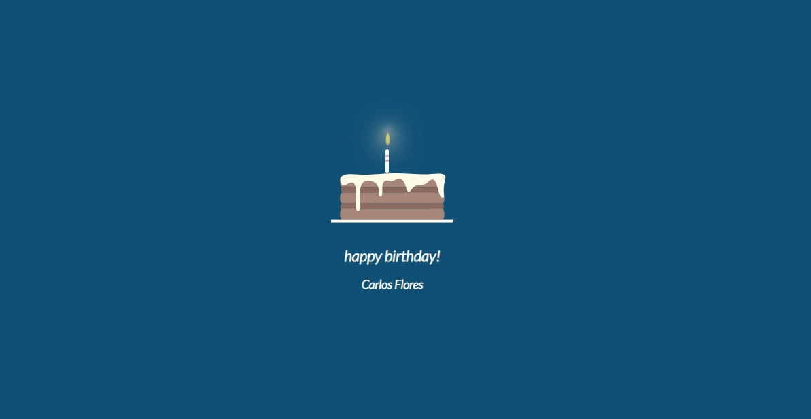

# 💻 Codigos HTML y CSS y JavaScript

Bienvenido a la **Codigos HTML y CSS y JavaScript**.

## 🌟 Descripción

Este sistema está desarrollado utilizando las siguientes tecnologías:
- **Versión AppWeb**: V 1.0.0
- **Fecha**: Febrero 24, 2025
- **Lenguaje de etiqueta**: HTML 5
- **Base de datos**: 

## 📞 Contacto

Si estás interesado en adquirir el sistema o tienes alguna pregunta, no dudes en contactarme:

- **Derechos de autor**: Copyright © 2025 Carlos Pcs Soluciones / All rights reserved
- **Desarrollador Web y Lider de Proyecto**: Carlos Flores / dev.cflores
- **WhatsApp**: +584123330319
- **Email**: cflores@carlospcssoluciones.com.ve.com
- **Usuario Instagram**: @dev.cflores
- **Usuario Threads**: @dev.cflores
- **Github**: https://github.com/encrypthdd/others-css.git

# 🛠️ Panel de Control

### ❤ <span>I LOVE YOU</span>


#### 📌 I Love You DEMO: 
```
https://demo.carlospcssoluciones.com.ve/dev.cflores/others/iloveyou/
```
### 🥧 <span>Birthday Cake</span>



#### 📌 Birthday Cake DEMO: 
```
https://demo.carlospcssoluciones.com.ve/dev.cflores/others/birthday-cake/
```
### 💡 <span>Lamp</span>


#### 📌 Birthday Cake DEMO: 
```
https://demo.carlospcssoluciones.com.ve/dev.cflores/others/lamp/
```